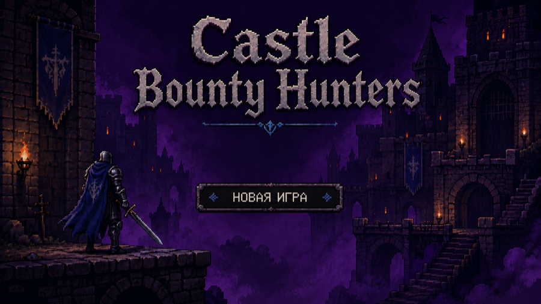
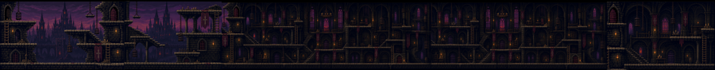
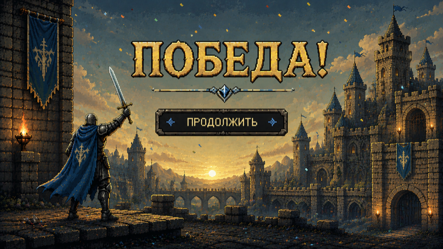
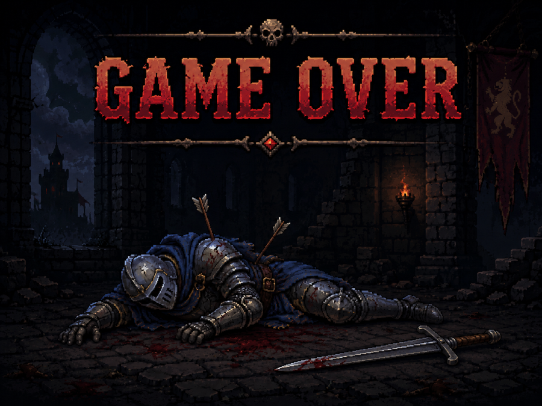
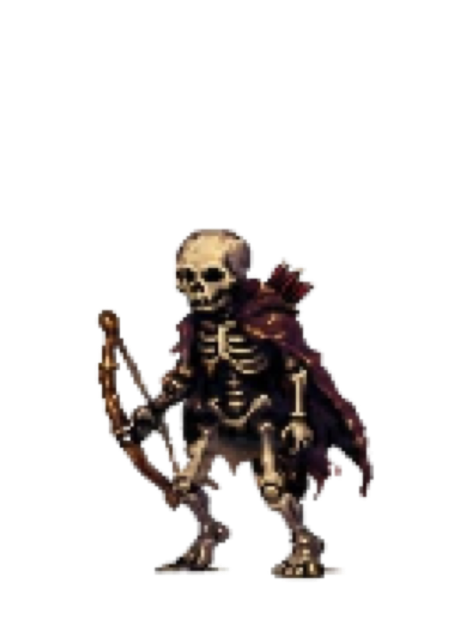
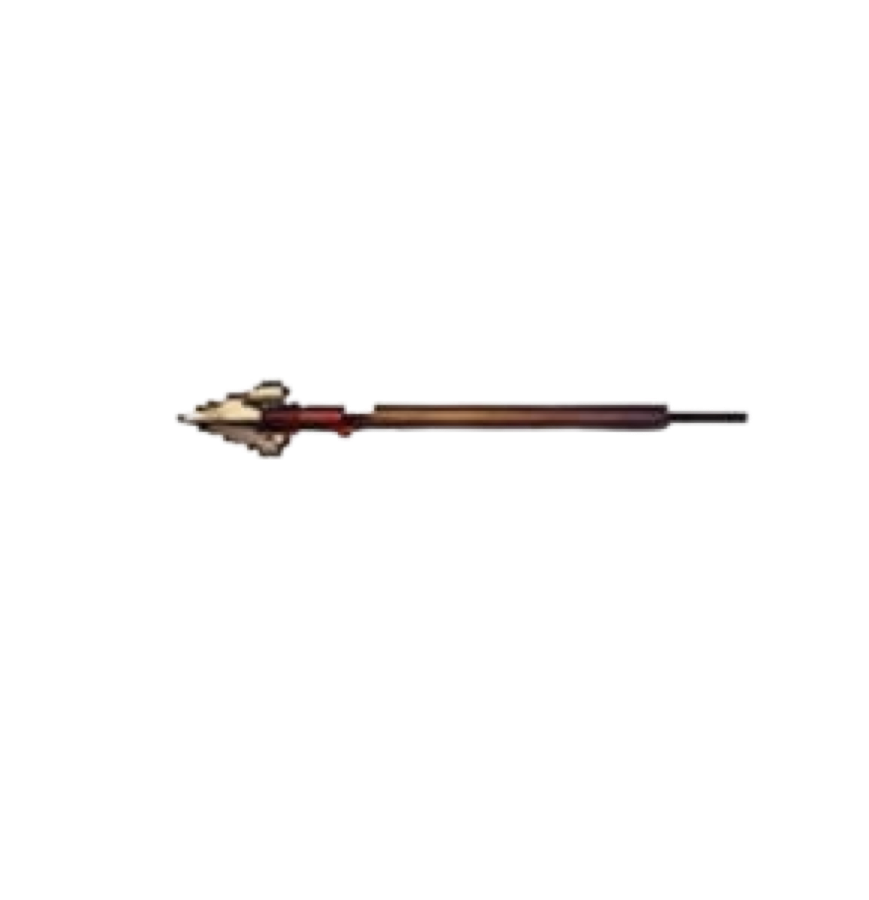
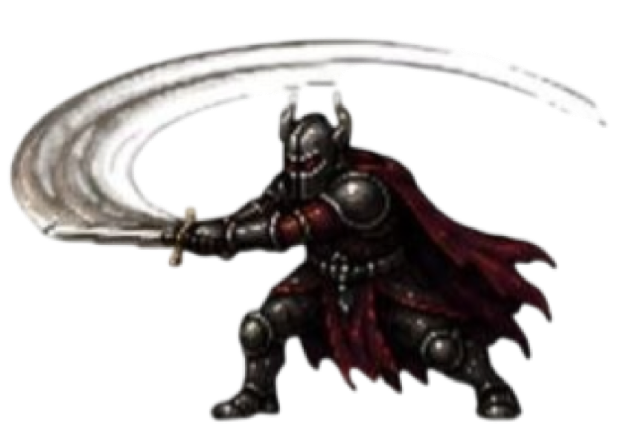

```
 _____   ___   _____ _____ _      _____  ______  _____ _   _ _   _ _______   __
/  __ \ / _ \ /  ___|_   _| |    |  ___| | ___ \|  _  | | | | \ | |_   _\ \ / /
| /  \// /_\ \\ `--.  | | | |    | |__   | |_/ /| | | | | | |  \| | | |  \ V /
| |    |  _  | `--. \ | | | |    |  __|  | ___ \| | | | | | | . ` | | |   \ /
| \__/\| | | |/\__/ / | | | |____| |___  | |_/ /\ \_/ / |_| | |\  | | |   | |
 \____/\_| |_/\____/  \_/ \_____/\____/  \____/  \___/ \___/\_| \_/ \_/   \_/
```

<p align="center">
  
  
  
  
</p>

<p align="center"><i>Cursed. Tight. Legendary.</i></p>

```
                                       ,.=,,==. ,,_
                      _ ,====, _    |I|`` ||  `|I `|
                     |`I|    || `==,|``   ^^   ``  |
                     | ``    ^^    ||_,===TT`==,,_ |
                     |,==Y``Y==,,__| \L=_-`'   +J/`
                      \|=_  ' -=#J/..-|=_-     =|
                       |=_   -;-='`. .|=_-     =|----T--,
                       |=/\  -|=_-. . |=_-/^\\  =||-|-|::|____
                       |=||  -|=_-. . |=_-| |  =|-|-||::\____
                       |=LJ  -|=_-. . |=_-|_| =||-|-|:::::::
                       |=_   -|=_-_.  |=_-     =|-|-||::::::
                       |=_   -|=//^\\. |=_-     =||-|-|::::::
                   ,   |/&_,_-|=||  | |=_-     =|-|-||::::::
                ,--``8%,/    ',%||  | |=_-     =||-|-|%::::::
            ,---`_,888`  ,.'''''`-.,|,|/!,--,.&\|&\-,|&#:::::
           |;:;K`__,...;=\_____,=``           %%%&     %#,---
           |;::::::::::::|       `'.________+-------\   ``
          /8M%;:::;;:::::|                  |        `-------
```

---

## ⚔ What is CastleBounty?

**CastleBounty** is a 2D pixel-art action platformer built in **Unity**. You are a lone
bounty hunter descending into a cursed castle. Fight through waves of skeletons,
dodge arrows, survive flying horrors — and face the thing waiting on the throne.

Tight combat. Retro soul. Dark fantasy atmosphere with a violet-magic glow.

## 🖼 Screenshots

| Main Menu | The Level |
|---|---|
|  |  |

| Victory | Game Over |
|---|---|
|  |  |

## ✨ Features

```
   ]=I==II==I=[
    \\__||__//
     | []   |
     |    ..|      <- YOU: walk, jump, slash, BLOCK
```

- **Tight pixel combat** — sword attacks, blocking, and precision movement
- **Enemy AI** — skeletons that chase you across the map
- **Ranged threats** — skeleton archers with real projectile arrows
- **Flying enemies** — horrors that come from above
- **A real BOSS fight** — multi-attack patterns, heavy attacks, boss health bar
- **Spawner system** — endless waves keep the pressure on
- **Full game loop** — Menu → Level → Victory / Game Over
- **Camera follow, health bars, scene management** — all hand-coded in C#

## 💀 The Enemies

| | |
|---|---|
|  | **Skeleton Warrior** — relentless chaser. Gets back up. Never stops. |
|  | **Skeleton Archer** — keeps distance, fires real arrow projectiles. |
|  | **THE BOSS** — heavy strikes, combo attacks, and a health bar that taunts you. Bring your block. |

## 🎮 Controls

| Action | Key |
|---|---|
| Move | ← → / A D |
| Jump | Space |
| Attack | J / Left Click |
| Block | K / Right Click |

## 🛠 Tech Stack

- **Engine:** Unity (2D, URP-ready)
- **Language:** C# — 19 custom gameplay scripts
- **Art:** Hand-drawn pixel sprites & animations
- **Audio:** Retro 8-bit SFX
- **Build targets:** WebGL, macOS, Windows

## 📁 Project Structure

```
Assets/
├── scripts/          # All gameplay C# (player, enemies, boss, UI)
├── Animations/       # Animator controllers & clips
├── Scenes/           # Menu.unity, Level.unity, Victory.unity, Gameover.unity
├── environment/      # Pixel art: backgrounds, sprites, UI
├── audio/            # SFX
└── TextMesh Pro/     # Text rendering
```

## 🗺 Roadmap

- [x] Player movement, jump, attack, block
- [x] Skeleton AI (chase + archer + spawner)
- [x] Flying enemy
- [x] Boss with patterns & heavy attacks
- [x] Full scene flow (Menu / Level / Victory / Game Over)
- [ ] More levels & biomes
- [ ] Pickups & upgrades
- [ ] Score system & leaderboards
- [ ] Itch.io release build

## 🚀 Getting Started

1. Clone the repo
   ```bash
   git clone https://github.com/nikgolobo/Unity.git
   ```
2. Open **Unity Hub** → *Add project from disk* → select the folder
3. Open the `Level` scene and press **Play**
4. Try to survive.

## 📜 License & Credits

Made with ☠️ and Unity by **nikgolobo**.
Sprites, animations and code are original work. Sound: retro 8-bit.

---

<p align="center">
  <i>"The castle pays bounty in blood."</i><br>
  ⬛ 🟪 ⬛
</p>
