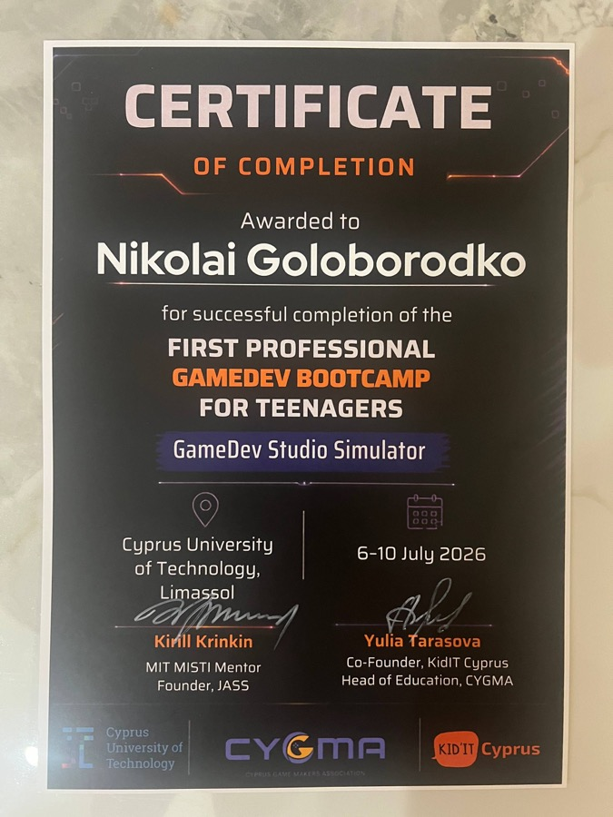

```
 _____   ___   _____ _____ _      _____  ______  _____ _   _ _   _ _______   __
/  __ \ / _ \ /  ___|_   _| |    |  ___| | ___ \|  _  | | | | \ | |_   _\ \ / /
| /  \// /_\ \\ `--.  | | | |    | |__   | |_/ /| | | | | | |  \| | | |  \ V /
| |    |  _  | `--. \ | | | |    |  __|  | ___ \| | | | | | | . ` | | |   \ /
| \__/\| | | |/\__/ / | | | |____| |___  | |_/ /\ \_/ / |_| | |\  | | |   | |
 \____/\_| |_/\____/  \_/ \_____/\____/  \____/  \___/ \___/\_| \_/ \_/   \_/
```

<p align="center">
  
  
  
  
</p>

<p align="center"><a href="README.md">English</a> | <b>简体中文</b></p>

<p align="center"><i>被诅咒。硬核。传奇。</i></p>

```
                                       ,.=,,==. ,,_
                      _ ,====, _    |I|`` ||  `|I `|
                     |`I|    || `==,|``   ^^   ``  |
                     | ``    ^^    ||_,===TT`==,,_ |
                     |,==Y``Y==,,__| \L=_-`'   +J/`
                      \|=_  ' -=#J/..-|=_-     =|
                       |=_   -;-='`. .|=_-     =|----T--,
                       |=/\  -|=_-. . |=_-/^\\  =||-|-|::|____
                       |=||  -|=_-. . |=_-| |  =|-|-||::\____
                       |=LJ  -|=_-. . |=_-|_| =||-|-|:::::::
                       |=_   -|=_-_.  |=_-     =|-|-||::::::
                       |=_   -|=//^\\. |=_-     =||-|-|::::::
                   ,   |/&_,_-|=||  | |=_-     =|-|-||::::::
                ,--``8%,/    ',%||  | |=_-     =||-|-|%::::::
            ,---`_,888`  ,.'''''`-.,|,|/!,--,.&\|&\-,|&#:::::
           |;:;K`__,...;=\_____,=``           %%%&     %#,---
           |;::::::::::::|       `'.________+-------\   ``
          /8M%;:::;;:::::|                  |        `-------
```

---

## ⚔ 什么是 CastleBounty?

**CastleBounty** 是一款用 **Unity** 打造的 2D 像素风动作平台游戏。
你是一名孤独的赏金猎人,潜入一座被诅咒的城堡。击退一波波骷髅,
躲开冷箭,在飞天的恐怖怪物爪下求生——最后,面对王座上等待着你的那个东西。

硬核战斗。复古灵魂。紫色魔光笼罩的黑暗奇幻氛围。

## 🖼 游戏截图

<p align="center">
  <br>
  <i>游戏画面 — 被诅咒的城堡在等待。</i>
</p>

| 主菜单 | 关卡 |
|---|---|
|  |  |

| 胜利 | 游戏结束 |
|---|---|
|  |  |

## ✨ 游戏特色

```
   ]=I==II==I=[
    \\__||__//
     | []   |
     |    ..|      <- 你:奔跑、跳跃、挥剑、格挡
```

- **硬核像素战斗** — 挥剑攻击、格挡、精准走位
- **敌人 AI** — 会全图追击你的骷髅兵
- **远程威胁** — 骷髅弓箭手,发射真实的箭矢弹道
- **飞行敌人** — 从天上扑下来的恐怖怪物
- **真正的 BOSS 战** — 多种攻击模式、重击、还有嘲讽你的 Boss 血条
- **刷怪系统** — 无尽波次,压力不断
- **完整游戏流程** — 主菜单 → 关卡 → 胜利 / 游戏结束
- **镜头跟随、血条、场景管理** — 全部用 C# 手写实现

## 💀 敌人图鉴

| | |
|---|---|
|  | **骷髅战士** — 穷追不舍。倒下了还会爬起来。永不停歇。 |
|  | **骷髅弓箭手** — 保持距离,射出真实的箭矢弹道。 |
|  | **BOSS** — 重击、连段攻击,还有一根嘲讽你的血条。记得格挡。 |

## 🏆 成就系统

```
      ___________
     '._==_==_=_.'
     .-\:      /-.
    | (|:.     |) |
     '-|:.     |-'
       \::.    /
        '::. .'
          ) (
        _.' '._
       `"""""""`
```

| 成就 | 解锁条件 |
|---|---|
| ☠️ **第一滴血** | 消灭第一只骷髅 |
| 💀 **骸骨收藏家** | 累计消灭 50 只骷髅 |
| 🛡️ **接箭能手** | 一局之内格挡 10 支箭 |
| 🦇 **害虫防治** | 消灭一只飞行敌人 |
| 👑 **赏金到手** | 击败 Boss |
| 🏃 **毫发无伤** | 不受到任何伤害通关 |
| 🪦 **墓地常客** | 死亡 10 次。城堡会记住你的 |
| ⚔️ **全额赏金** | 到达胜利画面 |
| 🎖️ **城堡传奇** | 解锁以上全部成就 |

## 🎮 操作方式

| 动作 | 按键 |
|---|---|
| 移动 | ← → / A D |
| 跳跃 | 空格 |
| 攻击 | J / 鼠标左键 |
| 格挡 | K / 鼠标右键 |

## 🛠 技术栈

- **引擎:** Unity(2D,URP-ready)
- **语言:** C# — 19 个手写游戏脚本
- **美术:** 手绘像素 sprites 与动画
- **音效:** 复古 8-bit 音效
- **构建目标:** WebGL、macOS、Windows

## 📁 项目结构

```
Assets/
├── scripts/          # 全部游戏 C# 代码(玩家、敌人、Boss、UI)
├── Animations/       # 动画控制器与动画片段
├── Scenes/           # Menu.unity、Level.unity、Victory.unity、Gameover.unity
├── environment/      # 像素美术:背景、精灵、UI
├── audio/            # 音效
└── TextMesh Pro/     # 文字渲染
```

## 🗺 开发路线图

- [x] 玩家移动、跳跃、攻击、格挡
- [x] 骷髅 AI(追击 + 弓箭手 + 刷怪)
- [x] 飞行敌人
- [x] 带攻击模式与重击的 Boss
- [x] 完整场景流程(主菜单 / 关卡 / 胜利 / 游戏结束)
- [ ] 更多关卡与生态
- [ ] 道具与升级系统
- [ ] 计分系统与排行榜
- [ ] Itch.io 正式发布版

## 🚀 快速开始

1. 克隆仓库
   ```bash
   git clone https://github.com/nikgolobo/Unity.git
   ```
2. 打开 **Unity Hub** → *Add project from disk* → 选择项目文件夹
3. 打开 `Level` 场景,点击 **Play**
4. 努力活下来。

## 📜 许可证与鸣谢

由 **nikgolobo** 用 ☠️ 和 Unity 打造。

- **代码:** [MIT 许可证](LICENSE) — 可自由使用、复制、修改和分发。
- **Sprites、动画与音频:** nikgolobo 原创 — 保留所有权利。

---

<p align="center">
  <i>"城堡用鲜血支付赏金。"</i><br>
  ⬛ 🟪 ⬛
</p>
